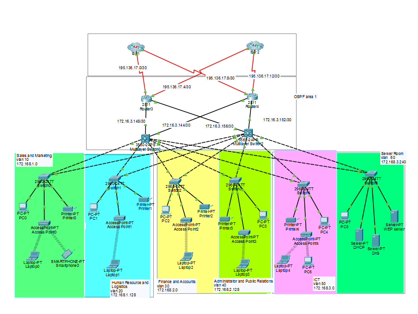

# Enterprise Network Infrastructure Project
# Dual-ISP Redundancy | OSPF | HSRP | NAT (PAT Overload) | VLANs | DHCP | SSH

# 📖 Overview

This project demonstrates the design and implementation of a secure, scalable, and highly available enterprise network using Cisco Packet Tracer. The network follows Cisco's three-layer hierarchical architecture (Core, Distribution, and Access) to improve performance, reliability, and network management.

The infrastructure eliminates single points of failure by implementing Dual-ISP redundancy, OSPF dynamic routing, HSRP gateway redundancy, VLAN segmentation, centralized DHCP services, PAT (NAT Overload), and SSHv2 for secure remote administration.

---

## 🎯 Project Objectives

- Design a scalable enterprise network.
- Provide high availability using HSRP.
- Ensure internet redundancy using Dual ISPs.
- Implement dynamic routing with OSPF.
- Segment the network using VLANs.
- Enable secure remote management via SSH.
- Configure PAT (NAT Overload) for Internet access.
- Centralize IP address management using DHCP Server.
- Improve network security and performance.

---

# 🏗 Network Architecture

The network follows Cisco's three-tier hierarchical architecture consisting of the **Core**, **Distribution**, and **Access** layers. The topology incorporates **Dual-ISP redundancy**, **OSPF dynamic routing**, **HSRP gateway redundancy**, **VLAN segmentation**, **PAT (NAT Overload)**, **Centralized DHCP**, and **SSHv2** for secure remote management.

## Network Topology



*Figure 1. Enterprise Network Infrastructure featuring Dual-ISP, OSPF, HSRP, VLANs, PAT (NAT Overload), DHCP, and SSH.*

---
# 🖥 Technologies Used

- Cisco Packet Tracer
- OSPF
- HSRP
- VLAN
- Inter-VLAN Routing
- PAT (NAT Overload)
- DHCP
- DHCP Relay
- SSH Version 2
- EtherChannel (Optional)
- Layer 3 Switching

---

# 🌐 VLAN Design

| VLAN | Department | Network |
|-------|------------|----------------|
| 10 | Sales & Marketing | 172.16.1.0/25 |
| 20 | HR & Logistics | 172.16.1.128/25 |
| 30 | Finance & Accounts | 172.16.2.0/25 |
| 40 | Administration & PR | 172.16.2.128/25 |
| 50 | ICT Department | 172.16.3.0/25 |
| 60 | Server Room | 172.16.3.240/28 |

---

# 🚀 Features

- Dual ISP Internet Connectivity
- Automatic Failover
- Dynamic Routing (OSPF Area 1)
- High Availability using HSRP
- Secure SSH Remote Access
- Centralized DHCP Server
- DHCP Relay (ip helper-address)
- PAT (NAT Overload)
- Inter-VLAN Routing
- Layer 3 Switching
- VLAN Segmentation
- Redundant Core Design

---

# 🔄 Routing Protocol

The network uses **OSPF (Open Shortest Path First)** as the dynamic routing protocol to enable automatic route learning and fast convergence across all Layer 3 devices.

- **Routing Protocol:** OSPF
- **Process ID:** 1
- **Area:** 1

## Loopback Interfaces (OSPF Router IDs)

Each Layer 3 device is configured with a **Loopback0** interface to provide a stable and unique OSPF Router ID.

| Device | Loopback Interface |
|--------|-------------------|
| R1 | 10.0.0.0/32 |
| R2 | 20.0.0.0/32 | 
| MLS1 | 30.0.0.0/32 |
| MLS2 | 40.0.0.0/32 | 

**Note:** Instead of manually configuring the `router-id` command, this project uses **Loopback0** interfaces. OSPF automatically selects the loopback address as the Router ID, providing a consistent identifier even if physical interfaces go down.

---

# ❤️ High Availability

HSRP provides gateway redundancy.

- MLS1 → Active Router
- MLS2 → Standby Router
- Preemption Enabled
- Automatic Failover

---

# 🌍 Internet Access

Internet connectivity is provided through two ISPs.

Features

- PAT (NAT Overload)
- Redundant WAN
- Public IP Translation
- Automatic Route Convergence

---

# 🖥 DHCP Server

Server IP

```
172.16.3.245
```

DHCP Relay

```cisco
ip helper-address 172.16.3.245
```

---

# 🔐 Security

- SSH Version 2
- Local User Authentication
- Encrypted Passwords
- Console Password
- VTY Line Protection
- Disable Telnet
- Secure Remote Login

---

# 📂 Project Structure

```
Enterprise-Network-Project/
│
├── PacketTracer/
│      Enterprise_Network.pkt
│
├── Configurations/
│      R1.txt
│      R2.txt
│      MLS1.txt
│      MLS2.txt
│
├── Images/
│      Network_Diagram.png
│
├── Documentation/
│      Project_Report.pdf
│
└── README.md
```

---

# 📸 Network Topology

> Add your network topology image here.

Example:

```
Images/Network_Diagram.png
```

---

# 🧪 Tested Services

- ✅ PC-to-PC Communication
- ✅ Inter-VLAN Routing
- ✅ DHCP Assignment
- ✅ OSPF Neighbor Adjacency
- ✅ HSRP Failover
- ✅ Internet Access
- ✅ NAT Translation
- ✅ SSH Login
- ✅ ISP Failover

---

# 📈 Skills Demonstrated

- Enterprise Network Design
- Cisco Routing & Switching
- Layer 2 Switching
- Layer 3 Switching
- OSPF Configuration
- HSRP Configuration
- NAT/PAT
- VLAN Design
- DHCP
- SSH
- Network Security
- High Availability
- Troubleshooting

---

# 📚 Learning Outcomes

Through this project, the following networking concepts were implemented and validated:

- Enterprise campus network design
- Redundant gateway implementation
- Dynamic routing
- VLAN segmentation
- Secure device management
- IP address management
- Internet connectivity using PAT
- Fault tolerance and network resilience

---

# 👨‍💻 Author

**Cabdiraxiin Nuur Siyaad Faarax**

Computer Science Student

Network & Cybersecurity Enthusiast

---

# ⭐ Acknowledgements

This project was developed for educational purposes to demonstrate enterprise networking concepts using Cisco Packet Tracer and Cisco networking technologies.
